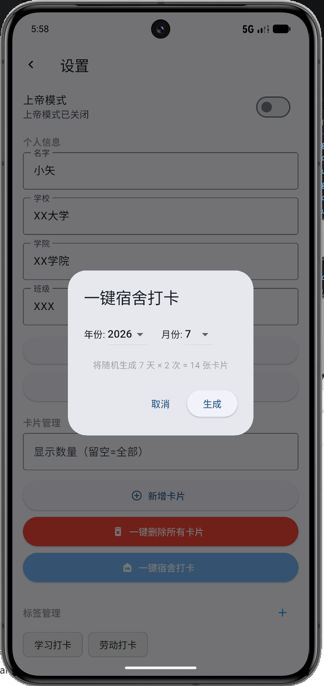
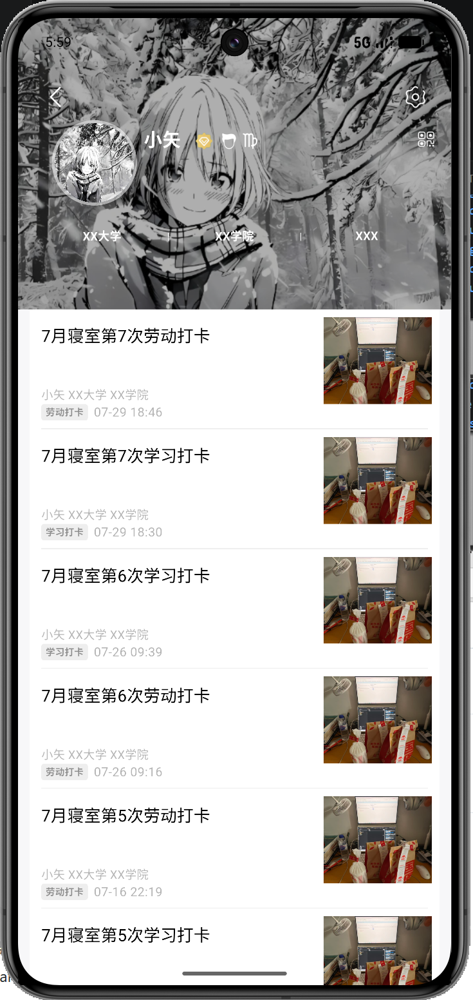
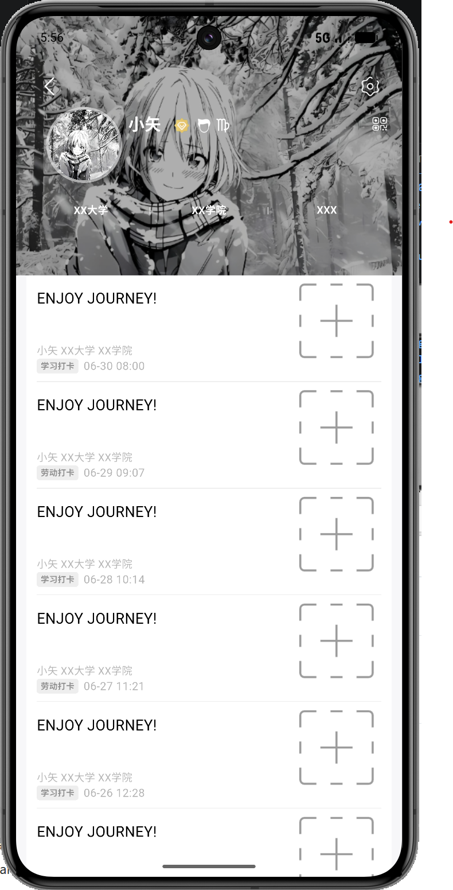
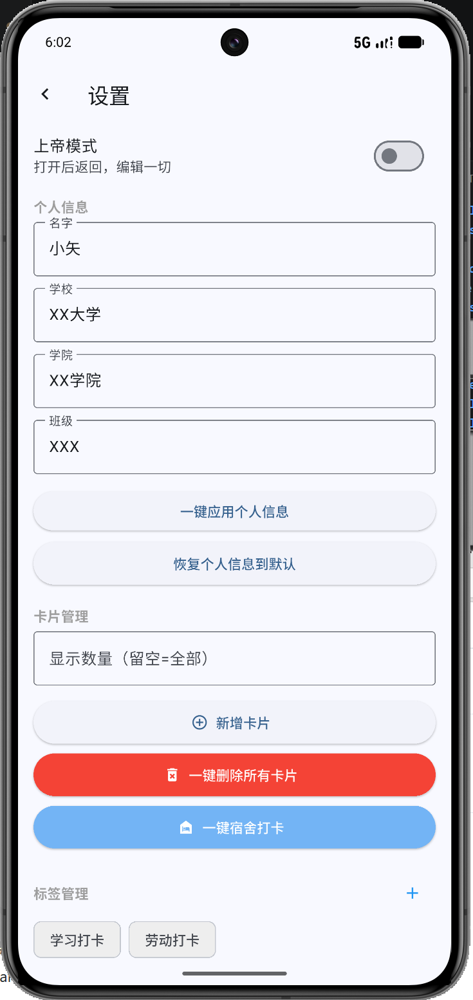

# Retime - 个人主页模拟器

目前软件处于测试阶段，自定义设置需要口令，联系作者邮箱获取：xiaoshijourney@163.com
仿校园社交平台 UI 的个人主页 App，支持自定义资料、动态卡片、标签管理等。

🌐 **在线体验**: [xiaoshijourney.hepi.ng](https://xiaoshijourney.hepi.ng/)

## 🏫 一键宿舍打卡

输入年份和月份，自动随机生成 7 天 × 2 次 = 14 张宿舍打卡卡片，学习打卡 + 劳动打卡各半，时间随机分布，省去手动填写的繁琐。

| 一键生成 | 打卡效果 |
|:---:|:---:|
|  |  |

| 生成演示 |
|:---:|
|  |

## 截图

| 个人首页 | 设置界面 |
|:---:|:---:|
|  |  |

## 🛠️ 上帝模式

打开后返回主页，点击任意元素即可编辑。换头像、换封面、改昵称、改信息、改标题、改署名、换标签、换图片——一切尽在掌控。

| 上帝模式演示 |
|:---:|
|  |

## 更多功能

- 📱 个人主页：封面图、头像、昵称、学校/学院/班级信息
- 📝 动态卡片：打卡记录卡片，支持按标签分类
- 🏷️ 标签管理：预设标签 + 自定义标签
- 💾 本地持久化：SharedPreferences 保存，无需服务器

## 下载

> [点击下载最新版本](https://github.com/xiaoshijourney/Retime-Personal-Homepage-Simulator/releases)

欢迎下载体验，有问题可以在 [Issues](https://github.com/xiaoshijourney/Retime-Personal-Homepage-Simulator/issues) 提出。

## 技术栈

Flutter 3 + Dart 3 + Material 3

## 免责声明

本项目仅供学习参考，不得用于任何商业或非法用途。使用者需自行承担因使用本软件而产生的一切法律风险和责任。

## 版权

© 2026 xiaoshijourney. All Rights Reserved.

本项目源码未开放。
